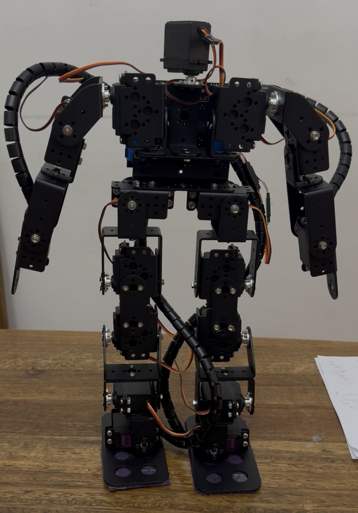
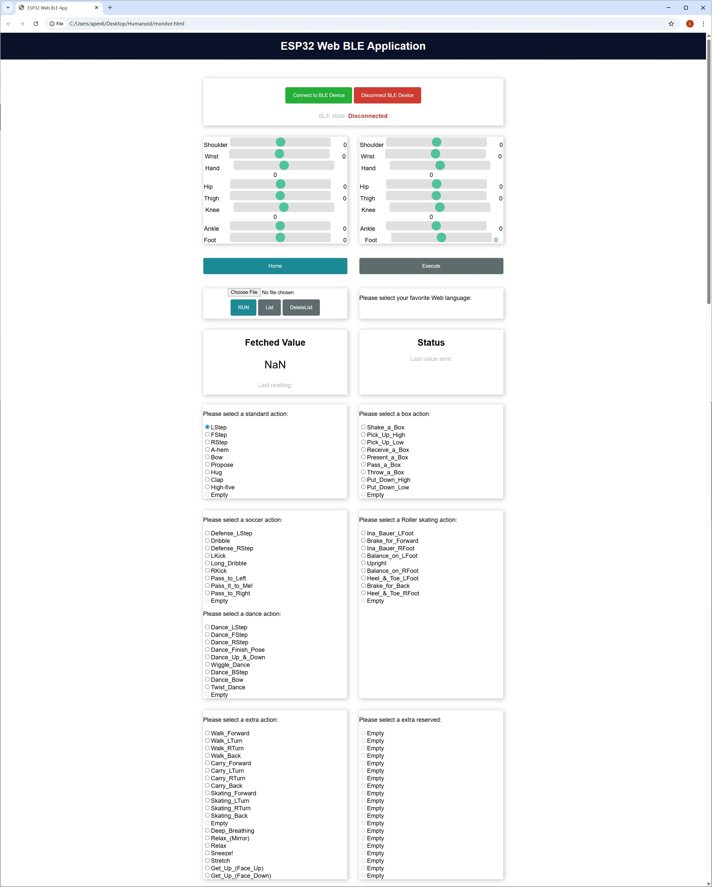
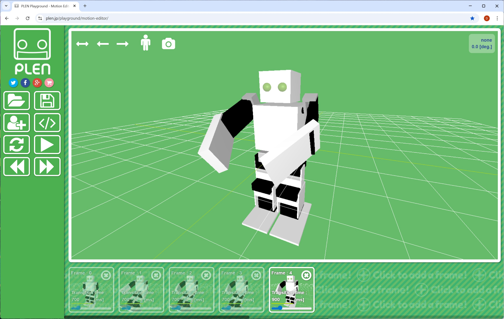
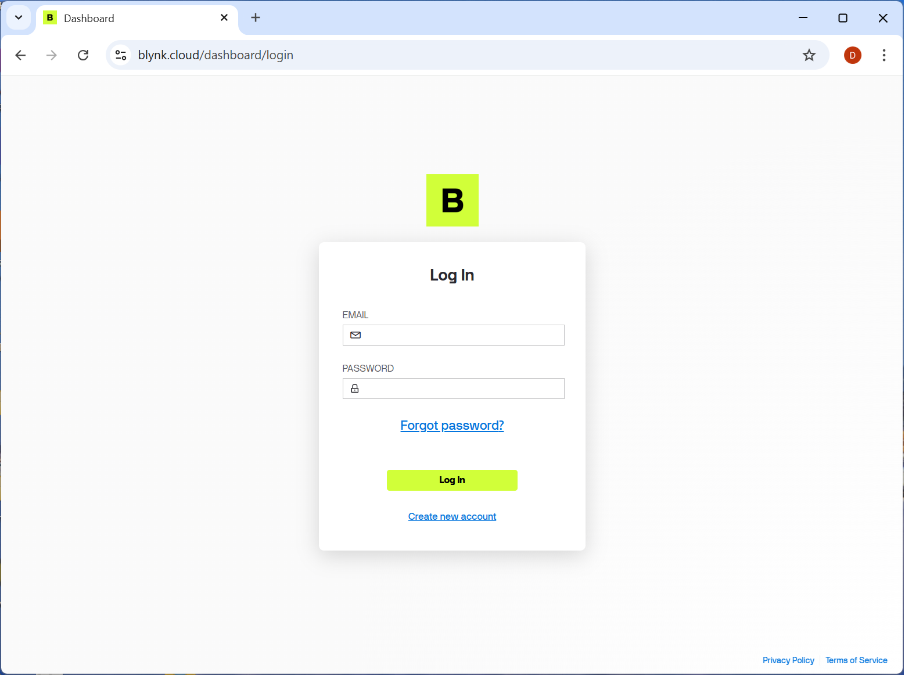
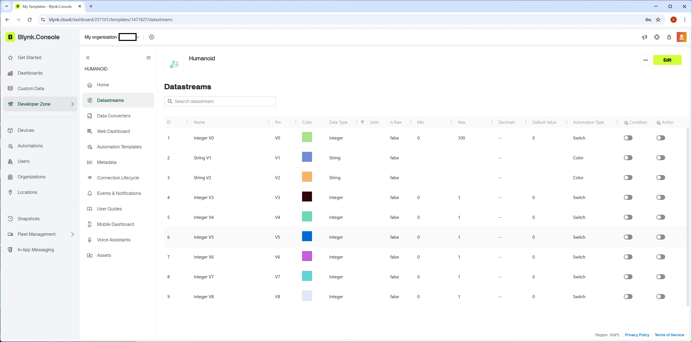

# Humanoid

## Introduction

I built a humanoid robot using the ESP32. For robot control, I used the ESP32's BLE or WiFi functions. I utilized PLEN's motion data to capture the robot's movement data.

## Control in webPage using ESP32's BLE

After connecting to the robot via BLE on a web browser on a laptop or PC, you can directly operate the 16 joints or open a data file for a specific continuous movement and make it move. The movement file is borrowed from PLEN-Project( https://github.com/plenprojectcompany ) and can be converted for use, and you can also create movements directly using PLEN's [motion-editor](https://plen.jp/playground/motion-editor/).

## Blynk Tools

[Blynk](https://www.blynk.io/) is an excellent platform for solving IoT problems.It is the most powerful tool when you want to control something on the Internet, whether it is on mobile or PC.
By defining the required streams in the Blynk.Console and connecting them to components, you can exchange data over the network.
You must first sign up on https://blynk.cloud/dashboard/login  before you can use it.

After defining the device and setting up the development template through the Blynk console, find out the following three values and enter them at the beginning of the source code: BLYNK TEMPLATE ID, BLYNK TEMPLATE_NAME, and BLYNK AUTHTOKEN.

| define |
|-|
|#define BLYNK_TEMPLATE_ID  "XMgt6fqp4aXvb" |
|#define BLYNK_TEMPLATE_NAME  "Humanoid" |
|#define BLYNK_AUTH_TOKEN  "0f0ffASdldldleefeeXXiCNCvQT3Ff3H" |

### Blynk App / Display

## Library
| Library | version | description |
|-|-|-|
| Blynk | 1.3.2 | IoT |
| ESP8266 and ESP32 OLED driver foe SSSD1306 | 4.6.2 | display |
| ArduinoJson | 7.4.2 | motion datat parsing  |
| ESP32Servo | 3.0.9 | Servo motor  |

## Tool
| Tool | version | description |
|-|-|-|
| Autodesk Eagle | 9.6.2 | hardware |
| Arduino IDE | 2.3.7 | software |

## Acknowledgments

I would like to thank to every one, specially PLEN project team and Rui Santos of RandomNerdTutorials for their contributions. 
